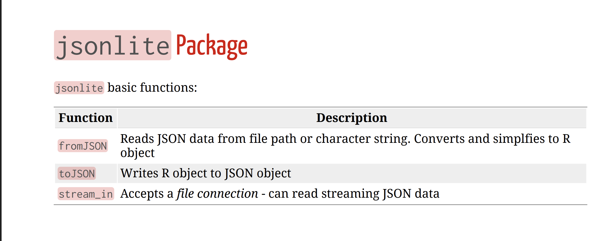
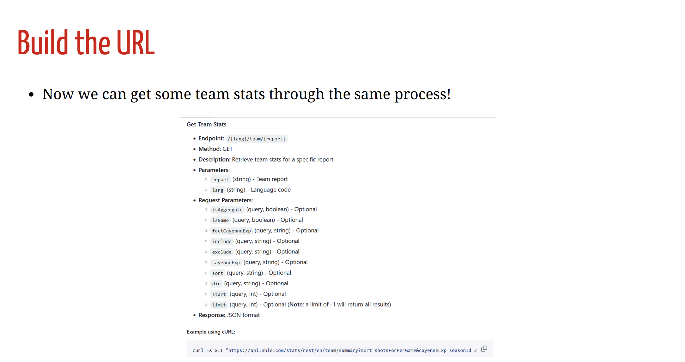

# Querying APIs

```{r}
library(tidycensus) #install first!

rent <- "DP04_0142PE" #PE means percentage
rent_data <- get_acs(variables = rent,
  geography = "county",
  geometry = TRUE,#returns the polygon data and allows for maps easily
  survey = "acs5",
  show_call = TRUE,
  key = "e267f117801b2ef741e54620602b0903c5f4d3c8") #can add state and other things
```

```{r}
#install mapview
rent_data |>
 mapview::mapview(zcol = "estimate",
 layer.name = "Median rent as a % of gross income")
```

Ok, what is going on with the `get_acs()` function?

- It calls `load_data_acs()` which builds the URL for us!
- Note this doesn't run

```{r}
load_data_acs <- function(geography, formatted_variables, key, year, state = NULL,
                          county = NULL, zcta = NULL, survey, show_call = FALSE) {
  base <- paste("https://api.census.gov/data",
  as.character(year), "acs",
  survey, sep = "/")
  if (grepl("^DP", formatted_variables)) {
    message("Using the ACS Data Profile")
    base <- paste0(base, "/profile")
  }
}
```

Let's build an API our self

Process:

- Build the appropriate URL

- Use `httr:GET()` to contact the web site

- Data is usually JSON (or possibly XML). Parse it!

- Try to put into a data frame



## Build the URL


```{r}
URL_ids <- "https://api.nhle.com/stats/rest/en/team"

id_info <- httr::GET(URL_ids)
str(id_info, max.level = 1)
```

Must parse this a bit... Usually data is in `content` or `results` element

- Often use `rawToChar()` with `jsonlite::fromJSON()`

```{r}
library(jsonlite)
library(dplyr)
parsed <- fromJSON(rawToChar(id_info$content))
team_info <- as_tibble(parsed$data)
team_info
```

Now we can get some team stats through the same process!



A few things can be modified but it isn't clear here what the values could be.

```{r}
URL_team_stats <- "https://api.nhle.com/stats/rest/en/team/summary?sort=wins&cayenneExp=seasonId=20232024%20and%20gameTypeId=2"
```

`GET()` it and parse it with the same process

```{r}
team_stats_return <- httr::GET(URL_team_stats)
parsed_team_stats <- fromJSON(rawToChar(team_stats_return$content))
team_stats <- as_tibble(parsed_team_stats$data)
```

Check it out

```{r}
team_stats |>
 select(teamId, teamFullName, everything())
```

# EDA (Exploratory Data Analysis)

Get to know your data!

EDA generally consists of a few steps:

- Understand how your data is stored

- Do basic data validation

- Determine rate of missing values

- Clean data up data as needed

- Investigate distributions

  - Univariate measures/graphs

  - Multivariate measures/graphs

- Apply transformations and repeat previous step

```{r}
#download data to local folder
library(tidyverse)
library(readxl)
app_data <- read_excel("app_data.xlsx", sheet = 1)
app_data
```

BMI shouldn't be a character variable?

`as.*()` family of functions can help coerce columns to the correct type

```{r}
app_data <- app_data |>
 mutate(BMI = as.numeric(BMI),
 US_Number = as.character(US_Number))
app_data
```

Do basic data validation

- Can use the psych::describe() function

- Check that the min's, max's, etc. all make sense!

```{r}
psych::describe(app_data)
```

Determine rate of missing values

```{r}
colSums(is.na(app_data))  #TRUE/FALSE dataframe
```

Can stay in the `tidyverse`

```{r}
sum_na <- function(column){
 sum(is.na(column))
}
na_counts <- app_data |>
 summarize(across(everything(), sum_na))
na_counts
```

Can remove rows with missing using `tidyr::drop_na()` function

```{r}
names(app_data)[na_counts < 30]
```

```{r}
app_data |>
 drop_na(names(app_data)[na_counts < 30])
```

May want to impute values

- We lose information when removing rows!

- Can impute missing values with `tidyr::replace_na()`

```{r}
app_data <- app_data |>
 replace_na(list(BMI = mean(app_data$BMI, na.rm = TRUE),
                 Height = mean(app_data$Height, na.rm = TRUE)))
app_data
```

## Investigate Distributions

- How to summarize data depends on the type of data

  - Categorical (Qualitative) variable - entries are a label or attribute

  - Numeric (Quantitative) variable - entries are a numerical value where math can be performed

- Numerical summaries (across subgroups)

  - Contingency Tables (for categorical data)

  - Mean/Median

  - Standard Deviation/Variance/IQR

  - Quantiles/Percentiles

- Graphical summaries (across subgroups)

  - Bar plots (for categorical data)

  - Histograms

  - Box plots

  - Scatter plots

### Categorical Data

A factor variable is really useful for certain categorical variables!

**Factor** - special class of vector with a `levels` attribute

- Can have more descriptive labels, ordering of categories, etc.

- Levels define all possible values for that variable

  - Great for variable like `Day` (Monday, Tuesday, ..., Sunday

  - Not great for variable like `Name` where new values may come up

- Great for plotting as you can order the levels and give nicer labels

Let's create factor versions of our three variables

```{r}
unique(app_data$Sex)
unique(app_data$Diagnosis)
unique(app_data$Severity)
```

Now we can use `factor()` or `as.factor()` to coerce the character variables

```{r}
app_data_count <- app_data |>
  mutate(SexF = factor(Sex, levels = c("female", "male"), labels = c("Female", "Male")), #Give old levels new labels
                       DiagnosisF = as.factor(Diagnosis),
                       SeverityF = as.factor(Severity)) |>
                       select(SexF, DiagnosisF, SeverityF)
```

Summarize categorical data by looking at counts (contingency tables)!

```{r}
app_data_count |>
 group_by(SexF) |>
 drop_na(SexF) |>
 summarize(count = n())
```

```{r}
app_data_count |>
 group_by(DiagnosisF) |>
 drop_na(DiagnosisF) |>
 summarize(count = n())
```

```{r}
app_data_count |>
 group_by(SexF, DiagnosisF) |>
 drop_na(SexF, DiagnosisF) |>
 summarize(count = n()) |>
 pivot_wider(names_from = DiagnosisF, values_from = count)
```

```{r}
app_data_count |>
 group_by(SexF, DiagnosisF, SeverityF) |>
 drop_na(SexF, DiagnosisF, SeverityF) |>
 summarize(count = n()) |>
 pivot_wider(names_from = DiagnosisF, values_from = count)
```

Main visual used is a bar plot! Simply displays our counts with bars. See *EDA Concepts* video for visuals

### Numeric Data

Goal: Describe the distribution of the variable

- Distribution = pattern and frequency with which you observe a variable

- Numeric variable - entries are a numerical value where math can be performed

For a single numeric variable, describe the distribution via

- Shape: Histogram, Density plot, ...

- Measures of center: Mean, Median, ...

- Measures of spread: Variance, Standard Deviation, Quartiles, IQR, ...

For two numeric variables, describe the distribution via

- Shape: Scatter plot, ...

- Measures of linear relationship: Covariance, Correlation

We summarize center and spread for a numeric variable because it is difficult to compare entire distributions!

- Mean and Median give good measures of the 'middle' type observations

```{r}
app_data |>
 group_by(Diagnosis) |>
 drop_na(Diagnosis, Weight) |>
 summarize(mean_weight = mean(Weight),
           median_weight = median(Weight))
```

Of course we need to understand the variability we see as well! Variance, standard deviation, and IQR are good measures of that.

```{r}
app_data |>
  group_by(Diagnosis) |>
  drop_na(Diagnosis, Weight) |>
  summarize(across(Weight, .fns = list("mean" = mean,
                                       "median" = median,
                                       "var" = var,
                                       "sd" = sd,
                                       "IQR" = IQR), .names = "{.fn}_{.col}"))
```

- Most easily done via histograms and density plots

  - Histograms are more variable, which can be bad!

- To look at the distribution of two numeric variables together, we usually look at a scatter plot!

- Again, difficult to describe the relationship generally!

  - Numerically we commonly describe the 'linear-ness' of the relationship

  - Done through covariance and correlation

```{r}
app_data |>
  drop_na(Weight, Age) |>
  summarize(cov = cov(Weight, Age), corr = cor(Weight, Age))
```

Of course we want to bring in subgroups to compare them!

```{r}
app_data |>
  drop_na(Weight, Age, Diagnosis) |>
  group_by(Diagnosis) |>
  summarize(cov = cov(Weight, Age), corr = cor(Weight, Age))
```

We can do really interesting stuff to add in additional variables (like a third numeric variable)

# Barplots and `ggplot2` Basics

Categorical (Qualitative) variable - entries are a label or attribute

- Numerical summary: contingency tables

- Graphical summary: bar plots

We can easily create plots in R (one of its real strengths!)

There are three major systems for plotting in R (and others that have been ported in)

- Base R (built-in functions)

- lattice

- ggplot2 (part of the tidyverse but not exactly)

We'll use ggplot2 as it is very popular. There is a great [ggplot2 reference book here](https://bookdown.org/rdpeng/exdata/plotting-systems.html)!

First, let's read in the appendicitis data from the previous lecture.

```{r}
library(tidyverse)
library(readxl)
app_data <- read_excel("app_data.xlsx", sheet = 1)
app_data <- app_data |>
  mutate(BMI = as.numeric(BMI),
         US_Number = as.character(US_Number),
         SexF = factor(Sex, levels = c("female", "male"), labels = c("Female", "Male")),
         DiagnosisF = as.factor(Diagnosis),
         SeverityF = as.factor(Severity))
app_data
```

[ggplot cheat sheet](https://rstudio.github.io/cheatsheets/data-visualization.pdf) is handy

```{r}
ggplot(data = app_data |> drop_na(SexF), aes(x = SexF))
```

```{r}
ggplot(data = app_data |> drop_na(SexF), aes(x = SexF)) +
 geom_bar()
```

Generally: Save base object with global aes() assignments, then add layers

```{r}
g <- ggplot(data = app_data |> drop_na(SexF), aes(x = SexF))
g + geom_bar()
```

```{r}
g <- ggplot(data = app_data |> drop_na(SexF), aes(x = SexF))

g + geom_bar() + labs(x = "Sex")
```

```{r}
g <- ggplot(data = app_data |> drop_na(SexF, DiagnosisF), aes(x = SexF, fill = DiagnosisF))
g + geom_bar() + labs(x = "Sex")
```

```{r}
g <- ggplot(data = app_data |> drop_na(SexF, DiagnosisF), aes(x = SexF, fill = DiagnosisF))
g + geom_bar() +
 labs(x = "Sex") +
 scale_fill_discrete("Diagnosis")
```

data and aes can be set in two ways:

1.  'globally' (for all layers) via the `aes()` function in the `ggplot()` call
2.  'locally' (for just that layer) via the `geom` or `stat` layer's `aes()`

```{r}
#global
ggplot(data = app_data |> drop_na(SexF, DiagnosisF), aes(x = SexF, fill = DiagnosisF)) +
 geom_bar()
```

```{r}
#some local, some global
ggplot(data = app_data |> drop_na(SexF, DiagnosisF), aes(x = SexF)) +
 geom_bar(aes(fill = DiagnosisF))
```

```{r}
#all local
ggplot(data = app_data |> drop_na(SexF, DiagnosisF)) +
 geom_bar(aes(x = SexF, fill = DiagnosisF))
```

Easy to rotate a plot with `coord_flip()`

```{r}
ggplot(data = app_data |> drop_na(SexF, DiagnosisF), aes(x = SexF, fill = DiagnosisF)) +
  geom_bar() +
  labs(x = "Sex")+
  scale_fill_discrete("Diagnosis")+
  coord_flip()
```

Note: Most geoms have a corresponding stat layer that can be used

```{r, eval = FASLE}
geom_bar(mapping = NULL, data = NULL, stat = "count",
         position = "stack", ..., width = NULL, binwidth = NULL, na.rm = FALSE,
         show.legend = NA, inherit.aes = TRUE)
```

Equivalent plots via:

```{r}
ggplot(data = app_data |> drop_na(SexF, DiagnosisF), aes(x = SexF, fill = DiagnosisF)) + geom_bar()

ggplot(data = app_data |> drop_na(SexF, DiagnosisF), aes(x = SexF, fill = DiagnosisF)) + stat_count()
```

Can modify the stat: if you have summary data, specify `y` and use `stat = identity`

```{r}
ggplot(data = app_data |>
  drop_na(SexF, DiagnosisF) |>
  group_by(SexF, DiagnosisF) |>
  summarize(count = n()), aes(x = SexF, y = count, fill = DiagnosisF)) +
    geom_bar(stat = "identity")
```

Side-by-side barplot created via the position aesthetic

◦ `dodge` for side-by-side bar plot

◦ `jitter` for continuous data with many points at same values

◦ `fill` stacks bars and standardizes each stack to have constant height

◦ `stack` stacks bars on top of each other

```{r}
ggplot(data = app_data |> drop_na(SexF, DiagnosisF), aes(x = SexF, fill = DiagnosisF)) +
  geom_bar(position = "dodge") +
  labs(x = "Sex")+
  scale_fill_discrete("Diagnosis")
```

`position = fill` stacks bars and standardizes each stack to have constant `height` (especially useful with equal group sizes)

```{r}
ggplot(data = app_data |> drop_na(SexF, DiagnosisF), aes(x = SexF, fill = DiagnosisF)) +
 geom_bar(position = "fill") +
 labs(x = "Sex")+
 scale_fill_discrete("Diagnosis")
```

# Numeric Variables and Graphs with `ggplot2`

First, let's read in the appendicitis data from the previous lecture.

```{r}
library(tidyverse)
library(readxl)
app_data <- read_excel("app_data.xlsx", sheet = 1)
app_data <- app_data |>
  mutate(BMI = as.numeric(BMI),
         US_Number = as.character(US_Number),
         SexF = factor(Sex, levels = c("female", "male"), labels = c("Female", "Male")),
         DiagnosisF = as.factor(Diagnosis),
         SeverityF = as.factor(Severity))
app_data
```

### Desnity Plots

```{r}
g <- ggplot(app_data |> drop_na(RBC_Count), aes(x = RBC_Count))
g + geom_density()
```

Remove really large value and use the `fill` aesthetic to compare groups

```{r}
g <- ggplot(app_data |> drop_na(RBC_Count, Diagnosis) |> filter(RBC_Count < 8), aes(x = RBC_Count))
g + geom_density(alpha = 0.5, aes(fill = Diagnosis))
```

Recall position choices of `dodge`, `jitter`, `fill`, and `stack`

```{r}
g <- ggplot(app_data |> drop_na(RBC_Count, Diagnosis) |> filter(RBC_Count < 8), aes(x = RBC_Count))
g + geom_density(alpha = 0.5, position = "fill", aes(fill = Diagnosis))
```

### Boxplots

```{r}
g <- ggplot(app_data |> drop_na(RBC_Count, Diagnosis) |> filter(RBC_Count < 8))
g + geom_boxplot(aes(x = Diagnosis, y = RBC_Count, fill = Diagnosis))
```

Can add data points (jittered) to see shape of data better (or use violin plot)

```{r}
g <- ggplot(app_data |> drop_na(RBC_Count, Diagnosis) |> filter(RBC_Count < 8))
g + geom_boxplot(aes(x = Diagnosis, y = RBC_Count, fill = Diagnosis)) +
    geom_jitter(width = 0.1, alpha = 0.3)
```

Oh, global vs local `aes()`!

```{r}
g <- ggplot(app_data |> drop_na(RBC_Count, Diagnosis) |> filter(RBC_Count < 8),
  aes(x = Diagnosis, y = RBC_Count, fill = Diagnosis))
g + geom_boxplot() +
    geom_jitter(width = 0.2, alpha = 0.3)
```

Order of layers important!

```{r}
g <- ggplot(app_data |> drop_na(RBC_Count, Diagnosis) |> filter(RBC_Count < 8),
 aes(x = Diagnosis, y = RBC_Count, fill = Diagnosis))
g + geom_jitter(width = 0.2, alpha = 0.3) +
 geom_boxplot()
```

Violin plot similar to boxplot

```{r}
g <- ggplot(app_data |> drop_na(RBC_Count, Diagnosis) |> filter(RBC_Count < 8),
 aes(x = Diagnosis, y = RBC_Count, fill = Diagnosis))
g + geom_violin()
```

### Scatter Plots

```{r}
g <- ggplot(app_data |> drop_na(RBC_Count, Weight, Diagnosis) |> filter(RBC_Count < 8),
 aes(x = Weight, y = RBC_Count, color = Diagnosis))
g + geom_point()
```

Add trend lines easily with `geom_smooth()`

```{r}
g <- ggplot(app_data |> drop_na(RBC_Count, Weight, Diagnosis) |> filter(RBC_Count < 8),
 aes(x = Weight, y = RBC_Count, color = Diagnosis))
g + geom_point() +
 geom_smooth(method = lm)
```

Text for points with `geom_text()`

```{r}
g <- ggplot(app_data |> drop_na(RBC_Count, Weight, Diagnosis) |> filter(RBC_Count < 8),
 aes(x = Weight, y = RBC_Count, color = Diagnosis))
g + geom_text(aes(label = Nausea)) +
 geom_smooth(method = lm)
```

Can add a note to the plot with `geom_text()` too

```{r}
correlation <- app_data |>
  drop_na(RBC_Count, Weight, Diagnosis) |>
  filter(RBC_Count < 8) |>
  group_by(Diagnosis) |>
  select(RBC_Count, Weight, Diagnosis) |>
  summarize(cor_vals = cor(RBC_Count, Weight, use = "complete.obs"))
correlation
```

```{r}
g <- ggplot(app_data |> drop_na(RBC_Count, Weight, Diagnosis) |> filter(RBC_Count < 8))
g + geom_point(aes(x = Weight, y = RBC_Count, color = Diagnosis)) +
 geom_smooth(method = lm, aes(x = Weight, y = RBC_Count, color = Diagnosis)) +
 geom_text(x = 75, y = 6, size = 3,
 label = paste0(correlation[1,1], " correlation: ", round(correlation[1,2], 2))) +
 geom_text(x = 75, y = 5.75, size = 3,
 label = paste0(correlation[2,1], " correlation: ", round(correlation[2,2], 2)))
```

### Faceting

Suppose we want to take one of our plots and produce similar plots across another variable!

How to create this plot across each Management category? Use faceting!

```{r}
ggplot(data = app_data |> drop_na(SexF, DiagnosisF), aes(x = SexF, fill = DiagnosisF)) +
  geom_bar(position = "dodge") +
  labs(x = "Sex")+
  scale_fill_discrete("Diagnosis")
```

`facet_wrap(~ var)` - creates a plot for each setting of `var`

- Can specify `nrow` and `ncol` or let R figure it out

`facet_grid(var1 ~ var2)` - creats a plot for each combination of `var1` and `var2`

- `var1` values across rows

- `var2` values across columns

- Use `. ~ var2` or `var1 ~ .` to have only one row or column

```{r}
ggplot(data = app_data |> drop_na(SexF, DiagnosisF, Management), aes(x = SexF, fill = DiagnosisF)) +
  geom_bar(position = "dodge") +
  labs(x = "Sex")+
  scale_fill_discrete("Diagnosis") +
  facet_wrap(~ Management)
```

Faceting can be used with any `ggplot`

```{r}
g <- ggplot(app_data |> drop_na(RBC_Count, Diagnosis, Sex) |> filter(RBC_Count < 8),
 aes(x = Diagnosis, y = RBC_Count, fill = Diagnosis))
g + geom_boxplot() +
 geom_jitter(width = 0.2, alpha = 0.3) +
 facet_wrap(~ Sex)
```

```{r}
g <- ggplot(app_data |> drop_na(RBC_Count, Weight, Diagnosis, Sex) |> filter(RBC_Count < 8),
 aes(x = Weight, y = RBC_Count, color = Diagnosis))
g + geom_point() +
 geom_smooth(method = lm) +
 facet_wrap(~ Sex)
```

### Themes

```{r}
g <- ggplot(app_data |> drop_na(RBC_Count, Weight, Diagnosis, Sex) |> filter(RBC_Count < 8),
 aes(x = Weight, y = RBC_Count, color = Diagnosis))
g + geom_point() +
 geom_smooth(method = lm) +
 facet_wrap(~ Sex) +
 theme_light()
```

```{r}
g <- ggplot(app_data |> drop_na(RBC_Count, Weight, Diagnosis, Sex) |> filter(RBC_Count < 8),
 aes(x = Weight, y = RBC_Count, color = Diagnosis))
g + geom_point() +
 geom_smooth(method = lm) +
 facet_wrap(~ Sex) +
 theme_dark()
```

### `ggplot2` Extensions

Many extension packages that do nice things!

- `GGally` package has the `ggpairs()` function

```{r}
library(GGally) #install if needed
ggpairs(app_data |> drop_na(RBC_Count, Weight, Diagnosis, Sex) |> filter(RBC_Count < 8),
 aes(colour = Diagnosis, alpha = 0.4), columns = c("RBC_Count", "Weight", "Sex"))
```

Over 100 registered extensions at https://exts.ggplot2.tidyverse.org/

- `gganimate` package allows for the creation of gifs

```{r}
#install each if needed
library(gapminder)
library(gganimate)
library(gifski)
gif <- ggplot(gapminder, aes(gdpPercap, lifeExp, size = pop, colour = country)) +
  geom_point(alpha = 0.7, show.legend = FALSE) +
  scale_colour_manual(values = country_colors) +
  scale_size(range = c(2, 12)) +
  scale_x_log10() +
  facet_wrap(~continent) +
 # Here comes the gganimate specific bits
  labs(title = 'Year: {frame_time}', x = 'GDP per capita', y = 'life expectancy') +
  transition_time(year) +
  ease_aes('linear')

# anim_save(filename = "img/myGif.gif", animation = gif, renderer = gifski_renderer())
```
